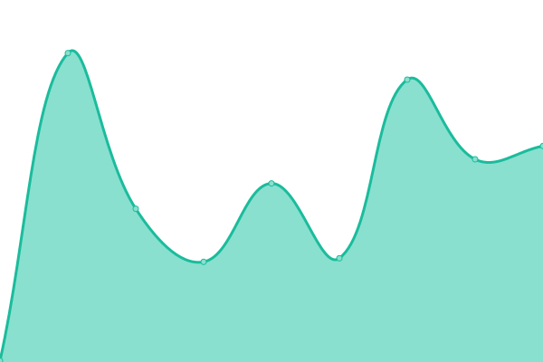
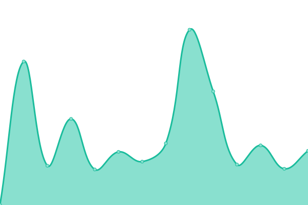
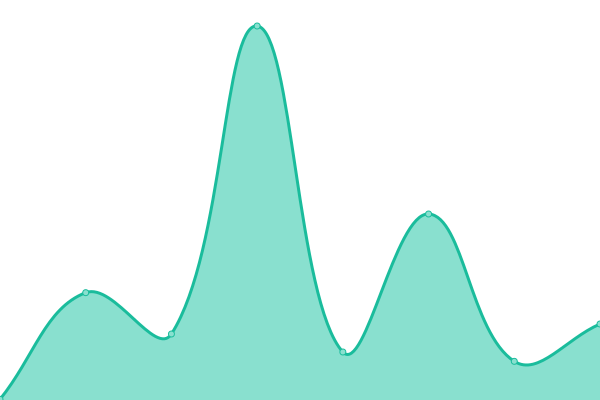
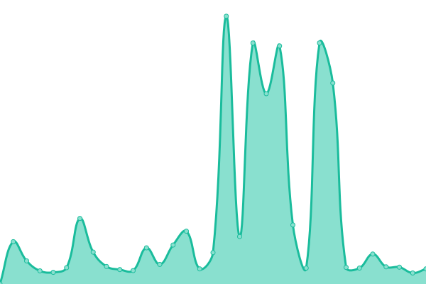

# [📈 Live Status](https://status.xhemj.eu.org/): <!--live status--> **所有站点都正常运行**

<!--start: status pages-->
<!-- This summary is generated by Upptime (https://github.com/upptime/upptime) -->
<!-- Do not edit this manually, your changes will be overwritten -->
<!-- prettier-ignore -->
| URL | Status | History | Response Time | Uptime |
| --- | ------ | ------- | ------------- | ------ |
|  [ERSS Mingyan (Vercel)](https://mingyan.js.org) | 正常 | [erss-mingyan-vercel.yml](https://github.com/icerss/upptime/commits/master/history/erss-mingyan-vercel.yml) | 

 201ms
     
 | 

<a href="https://status.xhemj.eu.org/history/erss-mingyan-vercel">99.75%</a>
    

|  [ERSS Mingyan (Github + Cloudflare)](https://i.xhemj.eu.org) | 正常 | [erss-mingyan-github-cloudflare.yml](https://github.com/icerss/upptime/commits/master/history/erss-mingyan-github-cloudflare.yml) | 

 293ms
     
 | 

<a href="https://status.xhemj.eu.org/history/erss-mingyan-github-cloudflare">100.00%</a>
    

|  [ERSS Mingyan (Coding)](https://cn.mingyan.js.org) | 正常 | [erss-mingyan-coding.yml](https://github.com/icerss/upptime/commits/master/history/erss-mingyan-coding.yml) | 

 1302ms
     
 | 

<a href="https://status.xhemj.eu.org/history/erss-mingyan-coding">100.00%</a>
    

|  [xhemj (Vercel)](https://xhemj.js.org) | 正常 | [xhemj-vercel.yml](https://github.com/icerss/upptime/commits/master/history/xhemj-vercel.yml) | 

 171ms
     
 | 

<a href="https://status.xhemj.eu.org/history/xhemj-vercel">100.00%</a>
    

|  [xhemj (Gitee)](https://xhemj.gitee.io) | 正常 | [xhemj-gitee.yml](https://github.com/icerss/upptime/commits/master/history/xhemj-gitee.yml) | 

 1206ms
     
 | 

<a href="https://status.xhemj.eu.org/history/xhemj-gitee">99.82%</a>
    

<!--end: status pages-->
