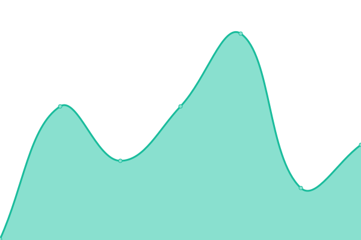
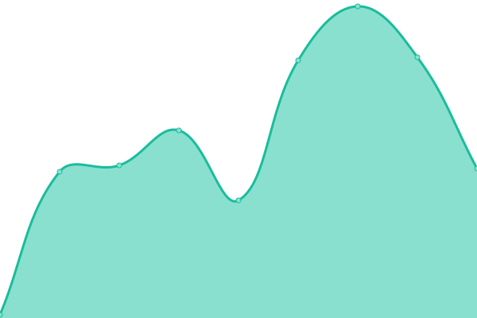

# [📈 Live Status](https://demo.upptime.js.org): <!--live status--> **🟩 All systems operational**

This repository contains the open-source uptime monitor and status page for [Upptime](https://upptime.js.org), powered by [Upptime](https://github.com/upptime/upptime).

With [Upptime](https://upptime.js.org), you can get your own unlimited and free uptime monitor and status page, powered entirely by a GitHub repository. We use [Issues](https://github.com/upptime/upptime/issues) as incident reports, [Actions](https://github.com/upptime/upptime/actions) as uptime monitors, and [Pages](https://demo.upptime.js.org) for the status page.

<!--start: status pages-->
<!-- This summary is generated by Upptime (https://github.com/upptime/upptime) -->
<!-- Do not edit this manually, your changes will be overwritten -->

| URL                                    | Status | History                                                                                      | Response Time                                                                    | Uptime                                                                                                                                                                                                               |
| -------------------------------------- | ------ | -------------------------------------------------------------------------------------------- | -------------------------------------------------------------------------------- | -------------------------------------------------------------------------------------------------------------------------------------------------------------------------------------------------------------------- |
| [Google](https://www.google.com)       | 🟩 Up  | [google.yml](https://github.com/xhemj/upptime/commits/master/history/google.yml)             |  61ms       |              |
| [Baidu](https://www.baidu.com)         | 🟩 Up  | [baidu.yml](https://github.com/xhemj/upptime/commits/master/history/baidu.yml)               |  1906ms      |                |
| [xhemj](https://xhemj.js.org)          | 🟩 Up  | [xhemj.yml](https://github.com/xhemj/upptime/commits/master/history/xhemj.yml)               |  282ms       |                |
| [ERSS Mingyan](https://mingyan.js.org) | 🟩 Up  | [erss-mingyan.yml](https://github.com/xhemj/upptime/commits/master/history/erss-mingyan.yml) |  64ms |  |

<!--end: status pages-->

[**Visit our status website →**](https://demo.upptime.js.org)

## 📄 License

- Code: [MIT](./LICENSE) © [Upptime](https://upptime.js.org)
- Data in the `./history` directory: [Open Database License](https://opendatacommons.org/licenses/odbl/1-0/)
