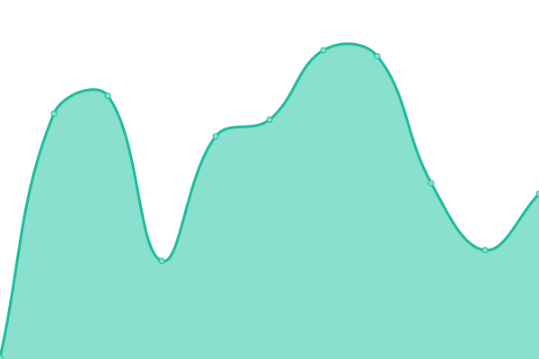
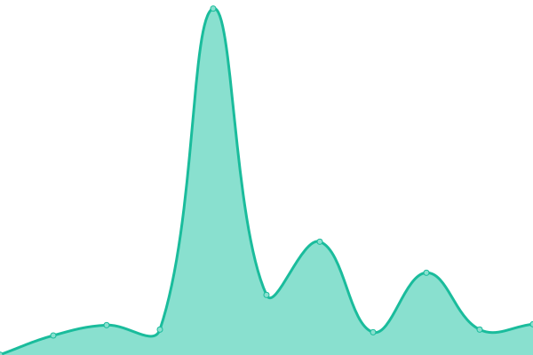

# [📈 Live Status](https://demo.upptime.js.org): <!--live status--> **🟩 All systems operational**

This repository contains the open-source uptime monitor and status page for [Upptime](https://upptime.js.org), powered by [Upptime](https://github.com/upptime/upptime).

With [Upptime](https://upptime.js.org), you can get your own unlimited and free uptime monitor and status page, powered entirely by a GitHub repository. We use [Issues](https://github.com/upptime/upptime/issues) as incident reports, [Actions](https://github.com/upptime/upptime/actions) as uptime monitors, and [Pages](https://demo.upptime.js.org) for the status page.

<!--start: status pages-->
<!-- This summary is generated by Upptime (https://github.com/upptime/upptime) -->
<!-- Do not edit this manually, your changes will be overwritten -->

| URL                                                          | Status | History                                                                                                                          | Response Time                                                                                       | Uptime                                                                                                                                                                                                                                               |
| ------------------------------------------------------------ | ------ | -------------------------------------------------------------------------------------------------------------------------------- | --------------------------------------------------------------------------------------------------- | ---------------------------------------------------------------------------------------------------------------------------------------------------------------------------------------------------------------------------------------------------- |
| [ERSS Mingyan (Vercel)](https://mingyan.js.org)              | 🟩 Up  | [erss-mingyan-vercel.yml](https://github.com/xhemj/upptime/commits/master/history/erss-mingyan-vercel.yml)                       |  146ms            |                        |
| [ERSS Mingyan (Github + Cloudflare)](https://i.xhemj.eu.org) | 🟩 Up  | [erss-mingyan-github-cloudflare.yml](https://github.com/xhemj/upptime/commits/master/history/erss-mingyan-github-cloudflare.yml) |  304ms |  |
| [ERSS Mingyan (Coding)](https://cn.mingyan.js.org)           | 🟩 Up  | [erss-mingyan-coding.yml](https://github.com/xhemj/upptime/commits/master/history/erss-mingyan-coding.yml)                       |  1179ms           |                        |
| [xhemj (Vercel)](https://xhemj.js.org)                       | 🟩 Up  | [xhemj-vercel.yml](https://github.com/xhemj/upptime/commits/master/history/xhemj-vercel.yml)                                     |  78ms                    |                                      |
| [xhemj (Gitee)](https://xhemj.gitee.io)                      | 🟩 Up  | [xhemj-gitee.yml](https://github.com/xhemj/upptime/commits/master/history/xhemj-gitee.yml)                                       |  1120ms                   |                                        |

<!--end: status pages-->

[**Visit our status website →**](https://demo.upptime.js.org)

## 📄 License

- Code: [MIT](./LICENSE) © [Upptime](https://upptime.js.org)
- Data in the `./history` directory: [Open Database License](https://opendatacommons.org/licenses/odbl/1-0/)
