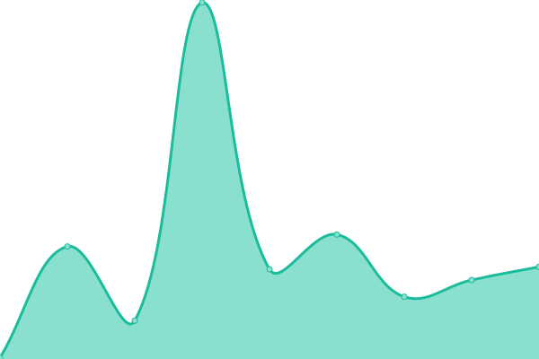

# [📈 Live Status](https://status.xhemj.eu.org/): <!--live status--> **🟧 Partial outage**

<!--start: status pages-->
<!-- This summary is generated by Upptime (https://github.com/upptime/upptime) -->
<!-- Do not edit this manually, your changes will be overwritten -->
<!-- prettier-ignore -->
| URL | Status | History | Response Time | Uptime |
| --- | ------ | ------- | ------------- | ------ |
|  [xhemj (Vercel)](https://xhemj.js.org) | 正常 | [xhemj-vercel.yml](https://github.com/icerss/upptime/commits/master/history/xhemj-vercel.yml) | 

 101ms
     
 | 

<a href="https://status.xhemj.eu.org/history/xhemj-vercel">99.76%</a>
    

|  [xhemj (Gitee)](https://xhemj.gitee.io) | 故障 | [xhemj-gitee.yml](https://github.com/icerss/upptime/commits/master/history/xhemj-gitee.yml) | 

 1827ms
     
 | 

<a href="https://status.xhemj.eu.org/history/xhemj-gitee">99.17%</a>
    

<!--end: status pages-->
